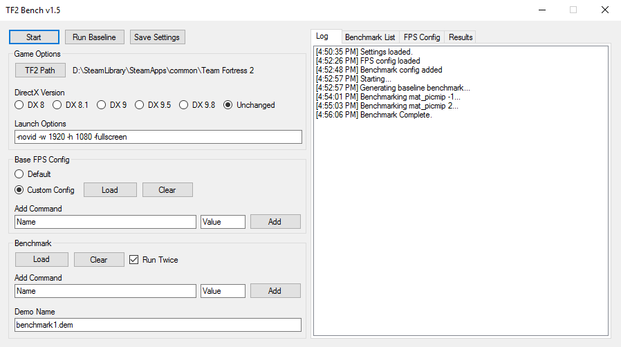

# TF2 Bench
An Automated Team Fortress 2 Benchmarker



### Setup

To begin, you need:
- A Team Fortress 2 installation.
- **(Optional)** FPS config to benchmark from.
- A demo, placed in the `tf` directory, to benchmark against.
- Commands to benchmark.

### Usage

1. Remove any configs that could interfere with the benchmark (usually autoexec.cfg)
2. Set your TF2 path to your `Team Fortress 2` directory (Usually steamapps/common/Team Fortress 2).
3. **(Optional)** Set your DirectX level.
4. Load an existing FPS config or use the default TF2 configuration.
5. Load or add commands to benchmark. The file format for loading benchmarks is described below.
6. **(Optional)** In the `Benchmark List` and `FPS Config` tabs, uncheck values you don't wish to use.
7. Specify the demo to benchmark.
8. Click start.
9. View the results in the `Results` tab.

### Keys

`Shift + F10` will stop a benchmark while it is running. TF2 will not immediately close, instead it will just finish the current command and stop. You should hear a sound after pressing it.

`Alt + S` will start and stop the benchmark.

`Alt + B` will run a baseline benchmark.

`Alt + P` will open the dialog to select the `Team Fortress 2` folder.

### FPS File Format

Any file with the extension `.cfg` can be imported to use as a 'base' to benchmark against.

Comments `//` should be automatically ignored, as well as mixed use of `" "`s.

### Benchmark File Format

To quickly add commands to benchmark, you can place your commands in a `.txt` file.
Each line will be parsed for a command, and benchmarked separately.
```
example_command 1
example_command "2"
// Both of these are accepted, comments like this are ignored
```

If you want to run multiple commands simultaneously, you can do so in the following format:
```
Name to display | example_command 1 | example_command 2 | example_command 3  ...
```

Working examples can be found in the `Benchmark Examples` folder.

### Process

Every time you start a benchmark, the program will perform the following steps:

1. Any existing `cfg/config.cfg` and `sourcebench.csv` files are backed up.
2. If needed, a baseline benchmark is created. During this phase:
  * The game is started.
  * The DirectX level is set.
  * If the `Default` option is selected, the game is started with the following parameters:
  ```
  [DirectX Level] -default -timedemo_comment "Baseline" [Custom Launch Options] +timedemoquit [Demo Name] 
  ```
  * If the `Custom Config` option is selected, the following parameters are used:
  ```
  [DirectX Level] -timedemo_comment "Baseline" [Custom Launch Options] +timedemo_runcount [1/2] +timedemoquit [Demo Name]
  ```
  * The command list is copied to `tf/custom/tfbench/cfg/autoexec.cfg`.
  * TF2 generates a clean `config.cfg` using the command `host_writeconfig`.
  * The game exits.
3. The main benchmark session starts.
  * For every command in the `Benchmark` list, an `autoexec.cfg` will be created with that command combined with the FPS config (if used).
  * Conflicts between existing commands and the benchmark values will be automatically resolved.
  * If the `Run Twice` box is checked, the benchmark will be run twice per command, with the first result discarded to ensure    consistency.
  * The following launch options are used:
  ```
  -timedemo_comment [Command Name] [Custom Launch Options] +timedemo_runcount [1/2] +timedemoquit [Demo Name] 
  ```
4. Results are parsed from the `sourcebench.csv` file, and displayed in the results tab.
5. Once finished, backed up files are restored, and temporary files are removed.

### Pitfalls

When benchmarking, it is important to note that there are a number of factors that can skew results.

* Ensure that you close out all applications that could interfere with the benchmark. These include internet browsers, VoIP applications, etc.
* Under normal conditions benchmarking can result in variations of ±2-3 fps between identical runs. Keep this in mind while evaluating results.
* Keeping `-dxlevel` in the launch options can negatively affect performance, and cause crashes. Remember to remove it once you've set your DirectX level to the desired value. Do **not** manually set the directx level when using TFBench, instead use the DirectX version selector.
* The benchmark cannot run twice in once session when using the `-default` launch parameter (#5), thus baseline results when using the `Default` option may be inaccurate.
